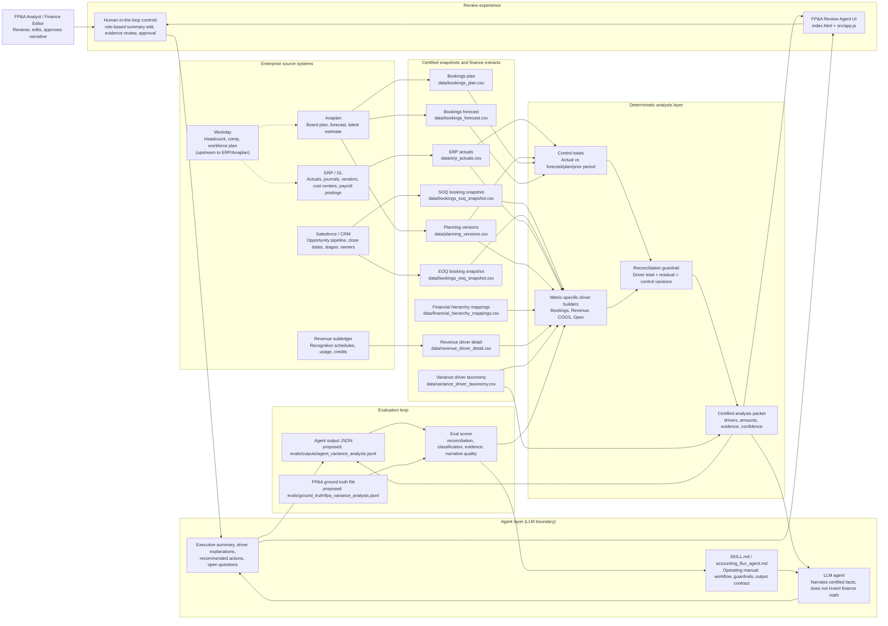

# FP&A Review Agent Architecture

## Interview Diagram



## Talk Track

The "agent" is the LLM-backed narration layer. It is not the source of financial truth. The source of truth is the deterministic analysis layer that calculates actual-versus-baseline variance, builds source-backed drivers, reconciles those drivers to control totals, and passes a certified packet to the LLM.

The skill file is the agent's operating manual. In this prototype, [accounting_flux_agent.md](</Users/rajatverma/Documents/Codex/FP&A Review Agent/accounting_flux_agent.md>) plays that role. In production I would package it as `SKILL.md`. It tells the LLM how to frame a variance, classify temporary versus structural drivers, avoid over-claiming, produce an executive summary, and return structured JSON. It should contain principles, workflow, guardrails, and output contract. It should not be the only place where machine-readable taxonomy lives.

The variance classification taxonomy is split in two places today. The conceptual taxonomy is in [accounting_flux_agent.md](</Users/rajatverma/Documents/Codex/FP&A Review Agent/accounting_flux_agent.md>), while the machine-readable taxonomy used by the app is [data/variance_driver_taxonomy.csv](</Users/rajatverma/Documents/Codex/FP&A Review Agent/data/variance_driver_taxonomy.csv>). For a workplace implementation, I would keep the taxonomy as a governed data artifact, such as a CSV/table/YAML file, and have `SKILL.md` explain how to use it.

## Source File Map

| Prototype file | Intended system of record | Role in architecture |
|---|---|---|
| `data/bookings_soq_snapshot.csv` | Salesforce / CRM snapshot | Start-of-quarter opportunity baseline for bookings movement |
| `data/bookings_eoq_snapshot.csv` | Salesforce / CRM snapshot | End-of-quarter opportunity outcomes: closed won, slipped, closed lost |
| `data/bookings_plan.csv` | Anaplan | Aggregate bookings plan baseline |
| `data/bookings_forecast.csv` | Anaplan | Aggregate bookings forecast baseline |
| `data/erp_actuals.csv` | ERP / GL | Actual revenue, COGS, Opex, payroll postings, vendor spend, journals |
| `data/planning_versions.csv` | Anaplan | Plan/forecast/latest-estimate rows at finance planning grain |
| `data/financial_hierarchy_mappings.csv` | Finance master data | Maps GL accounts to statement lines and driver categories |
| `data/revenue_driver_detail.csv` | Revenue subledger / rev-rec system | Source-backed revenue explanations such as recognition timing |
| `data/variance_driver_taxonomy.csv` | Governed finance taxonomy | Machine-readable driver classes, descriptions, and dimensions |

## SOQ And EOQ Snapshots

For bookings, the minimum snapshot pair is:

- SOQ snapshot: opportunities expected in the quarter at the beginning of the quarter.
- EOQ snapshot: final quarter-end outcomes for the same opportunities plus new in-quarter deals.

The prototype uses `bookings_soq_snapshot.csv` and `bookings_eoq_snapshot.csv`. In a workplace implementation, these likely come from Salesforce or another CRM, either directly or through Snowflake. If the files are extracted from Snowflake, Snowflake is the analytical warehouse, while Salesforce remains the originating source system.

For revenue, COGS, and Opex, SOQ/EOQ opportunity snapshots are not enough. Those metrics need ERP actuals, Anaplan plan/forecast versions, hierarchy mappings, and metric-specific source detail such as revenue schedules, vendor invoices, cloud usage, or workforce cost.

## Headcount Spend

Headcount spend usually has two paths:

- Planned headcount and workforce assumptions live in Anaplan or another planning model.
- Actual payroll cost originates in Workday or payroll systems and posts into the ERP/GL.

So in the architecture, Workday is upstream. The agent should generally analyze actual headcount cost from ERP actuals, then use Workday/Anaplan detail as drill-down evidence when needed.

## Human In The Loop

The human is in the review and approval layer, after the deterministic packet and LLM narrative are produced. In this prototype, the human-in-the-loop behavior appears as the Finance Editor role and editable executive summary in [src/app.js](</Users/rajatverma/Documents/Codex/FP&A Review Agent/src/app.js>). In production, this would become an approval workflow: analyst reviews evidence, edits narrative, approves output, and rejected outputs feed evals or taxonomy/rules improvements.

## Eval Output

There is no eval output file in the current repo yet. I would add one explicit agent output contract:

```text
evals/outputs/agent_variance_analysis.jsonl
```

Each row should contain the selected review context, control total, reconciled drivers, source evidence, LLM narrative, recommended actions, confidence, and residual. That can be compared to:

```text
evals/ground_truth/fpa_variance_analysis.jsonl
```

The scorer should compare:

- Math reconciliation: drivers tie to the control variance.
- Classification accuracy: driver categories match FP&A ground truth.
- Evidence grounding: cited rows support the explanation.
- Narrative quality: summary is concise, decision-ready, and does not overstate recovery.
- Open questions: missing data and residuals are surfaced instead of hidden.

## Open Questions To Confirm

1. Is Snowflake the warehouse layer between Salesforce/ERP/Workday/Anaplan and the agent, or are files exported directly from each system?
2. Which ERP is used at your workplace, and does Workday payroll post into that ERP before FP&A reviews actual headcount cost?
3. What is the current FP&A ground truth format: analyst-written markdown, Excel bridge, CSV, or JSON?
4. Should evals judge only classification/math, or also executive narrative quality and recommended actions?
